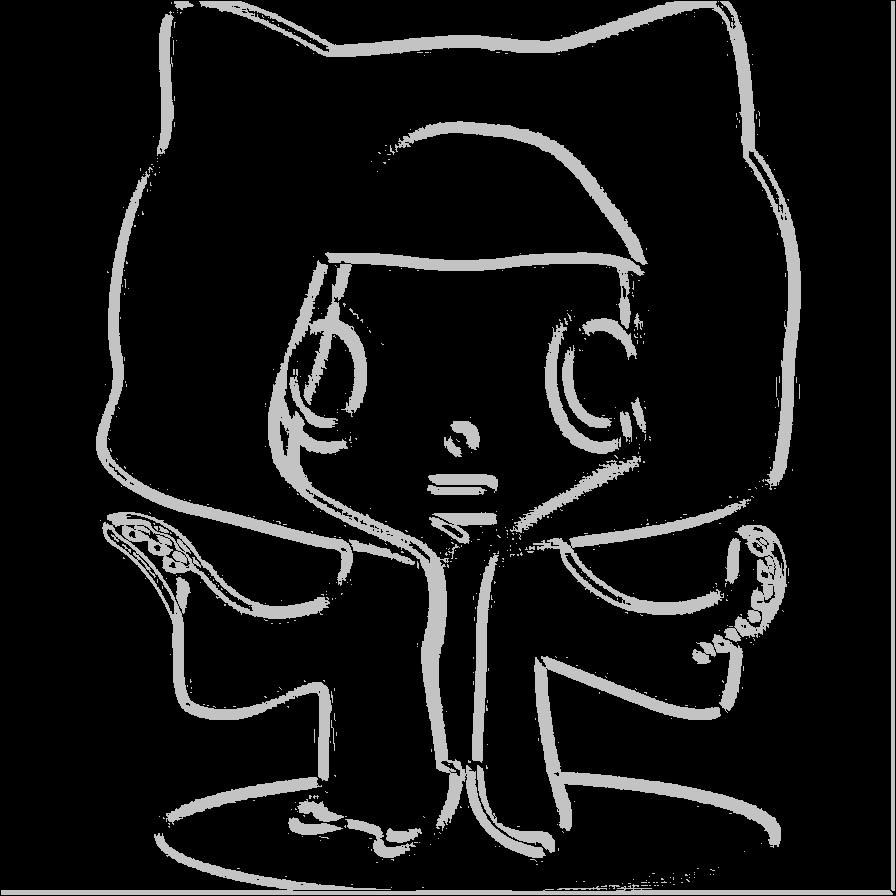
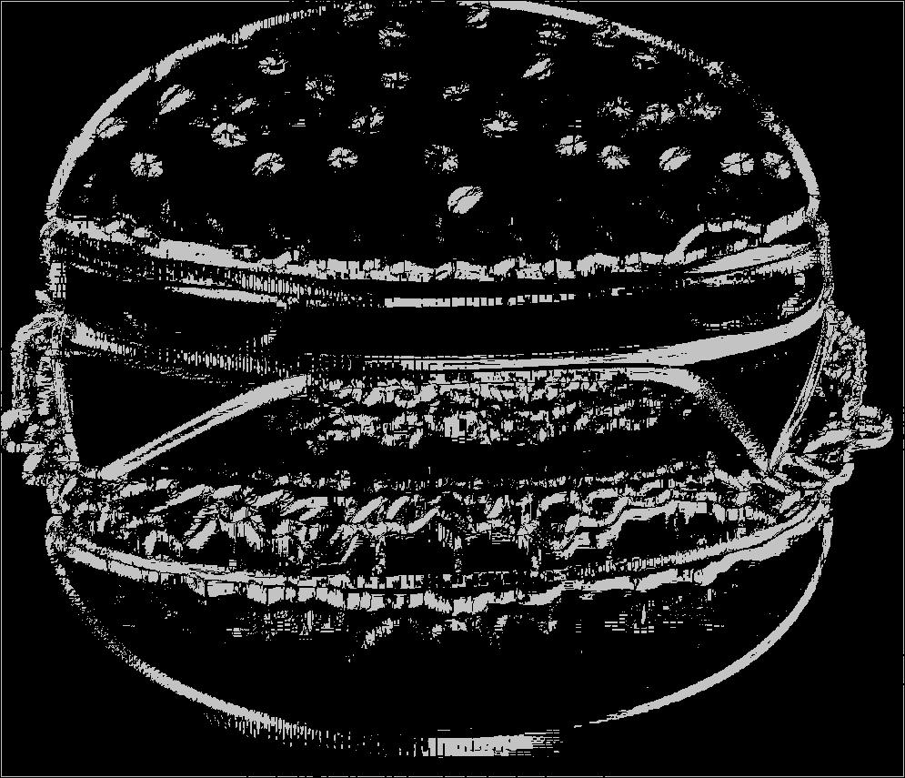
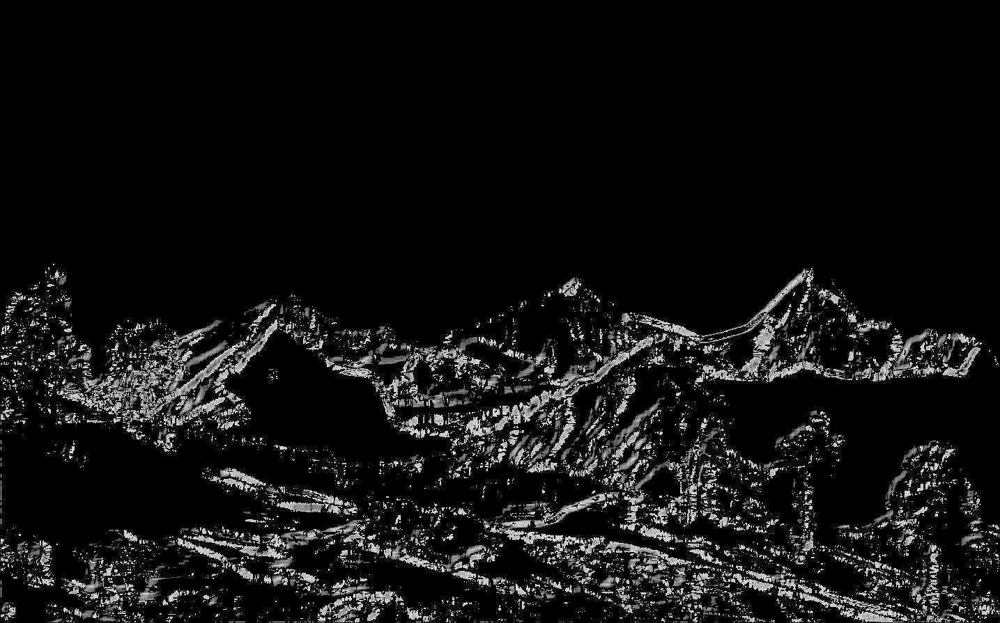

# LowPoly2D
LowPoly2D for Golang go 语言2d低面设计算法实现

暂时为 Sobel 边缘检测：

sourceImg | tagImg 
---|---
 | 
 | 
 | 

### Usage

```bash
$ go get github.com/jeasonstudio/GaussianBlur
$ go get github.com/jeasonstudio/LowPoly2D
```

```go
// SobelEdge 计算图像边缘，使用八方向无阶的 Sobel 算子
// soursourceImg, tagImg 为原图像、目标图像的相对地址
// lowSigema,highSigema 两个阈值，低阈值和高阈值，可调整 范围 0~65535
// p,q nil，暂时无用

func SobelEdge(sourceImg, tagImg string, lowSigema, highSigema uint16, p, q int) {
```

```go
func main() {
    GaussianBlur.GBlurInit("fj.jpg", "zct.jpg", 5, 500)
    SobelEdge.SobelEdge("zct.jpg", "tag.jpg", 20000, 57000, nil, nil)
}
```